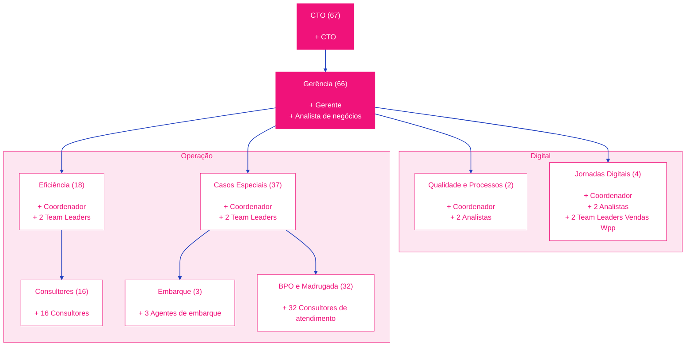

```mermaid
flowchart TD
    CTO["CTO (67)<br/><br/>+ CTO"]
    GER["Gerência (66)<br/><br/>+ Gerente<br/>+ Analista de negócios"]

    subgraph Digital
        C1["Qualidade e Processos (2)<br/><br/>+ Coordenador<br/>+ 2 Analistas"]
        C2["Jornadas Digitais (4)<br/><br/>+ Coordenador<br/>+ 2 Analistas<br/>+ 2 Team Leaders Vendas Wpp"]
    end

    subgraph Operacao["Operação"]
        C3["Eficiência (18)<br/><br/>+ Coordenador<br/>+ 2 Team Leaders"]
        C4["Casos Especiais (37)<br/><br/>+ Coordenador<br/>+ 2 Team Leaders"]
        D1["Consultores (16)<br/><br/>+ 16 Consultores"]
        D2["Embarque (3)<br/><br/>+ 3 Agentes de embarque"]
        D3["BPO e Madrugada (32)<br/><br/>+ 32 Consultores de atendimento"]
    end

    CTO --> GER
    GER --> C1
    GER --> C2
    GER --> C3
    GER --> C4
    C3 --> D1
    C4 --> D2
    C4 --> D3

    classDef lider fill:#f0127a,stroke:#f0127a,color:#ffffff
    classDef time fill:#ffffff,stroke:#f0127a,color:#f0127a
    class CTO,GER lider
    class C1,C2,C3,C4,D1,D2,D3 time
    style Digital fill:#fde6f1,stroke:#f0127a,color:#f0127a
    style Operacao fill:#fde6f1,stroke:#f0127a,color:#f0127a
    linkStyle default stroke:#1f3fbf,stroke-width:1.5px
```
