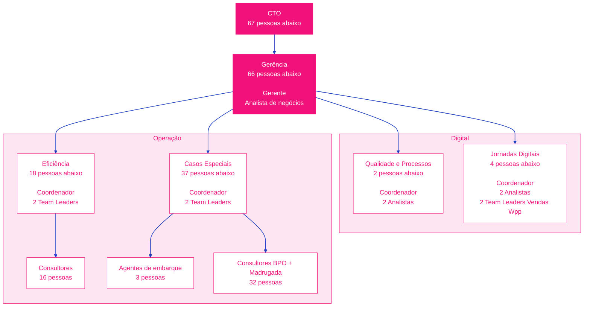

```mermaid
flowchart TD
    CTO["CTO<br/>67 pessoas abaixo"]
    GER["Gerência<br/>66 pessoas abaixo<br/><br/>Gerente<br/>Analista de negócios"]

    subgraph Digital
        C1["Qualidade e Processos<br/>2 pessoas abaixo<br/><br/>Coordenador<br/>2 Analistas"]
        C2["Jornadas Digitais<br/>4 pessoas abaixo<br/><br/>Coordenador<br/>2 Analistas<br/>2 Team Leaders Vendas Wpp"]
    end

    subgraph Operacao["Operação"]
        C3["Eficiência<br/>18 pessoas abaixo<br/><br/>Coordenador<br/>2 Team Leaders"]
        C4["Casos Especiais<br/>37 pessoas abaixo<br/><br/>Coordenador<br/>2 Team Leaders"]
        D1["Consultores<br/>16 pessoas"]
        D2["Agentes de embarque<br/>3 pessoas"]
        D3["Consultores BPO + Madrugada<br/>32 pessoas"]
    end

    CTO --> GER
    GER --> C1
    GER --> C2
    GER --> C3
    GER --> C4
    C3 --> D1
    C4 --> D2
    C4 --> D3

    classDef lider fill:#f0127a,stroke:#f0127a,color:#ffffff
    classDef time fill:#ffffff,stroke:#f0127a,color:#f0127a
    class CTO,GER lider
    class C1,C2,C3,C4,D1,D2,D3 time
    style Digital fill:#fde6f1,stroke:#f0127a,color:#f0127a
    style Operacao fill:#fde6f1,stroke:#f0127a,color:#f0127a
    linkStyle default stroke:#1f3fbf,stroke-width:1.5px
```
